# Web-App

This project was bootstrapped with [Create React App](https://github.com/facebook/create-react-app).

## Available Scripts

In the project directory, you can run:

### `npm start`

Runs the app in the development mode. 
Open [http://localhost:3000](http://localhost:3000) to view it in the browser.

The page will reload if you make edits. 
You will also see any lint errors in the console.

### `npm test`

Launches the test runner in the interactive watch mode. 
See the section about [running tests](https://facebook.github.io/create-react-app/docs/running-tests) for more information.

### `npm run build`

Builds the app for production to the `build` folder. 
It correctly bundles React in production mode and optimizes the build for the best performance.

The build is minified and the filenames include the hashes. 
Your app is ready to be deployed!

See the section about [deployment](https://facebook.github.io/create-react-app/docs/deployment) for more information.

### `npm run eject`

**Note: this is a one-way operation. Once you `eject`, you can’t go back!**

If you aren’t satisfied with the build tool and configuration choices, you can `eject` at any time. This command will remove the single build dependency from your project.

Instead, it will copy all the configuration files and the transitive dependencies (webpack, Babel, ESLint, etc) right into your project so you have full control over them. All of the commands except `eject` will still work, but they will point to the copied scripts so you can tweak them. At this point you’re on your own.

You don’t have to ever use `eject`. The curated feature set is suitable for small and middle deployments, and you shouldn’t feel obligated to use this feature. However we understand that this tool wouldn’t be useful if you couldn’t customize it when you are ready for it.

## Learn More

You can learn more in the [Create React App documentation](https://facebook.github.io/create-react-app/docs/getting-started).

To learn React, check out the [React documentation](https://reactjs.org/).

### Code Splitting

This section has moved here: https://facebook.github.io/create-react-app/docs/code-splitting

### Analyzing the Bundle Size

This section has moved here: https://facebook.github.io/create-react-app/docs/analyzing-the-bundle-size

### Making a Progressive Web App

This section has moved here: https://facebook.github.io/create-react-app/docs/making-a-progressive-web-app

### Advanced Configuration

This section has moved here: https://facebook.github.io/create-react-app/docs/advanced-configuration

### Deployment

This section has moved here: https://facebook.github.io/create-react-app/docs/deployment

### `npm run build` fails to minify

This section has moved here: https://facebook.github.io/create-react-app/docs/troubleshooting#npm-run-build-fails-to-minify

## Functionality of Web Apps

The user can perform all the curd operations in the web app. It also includes a share feature where thw user can share notes with others and also mark the note as favourate which act as bookmark for the user.It is combined with high end encrytion of Firebase and databse services like firestore which the the latest in the market and works on No-SQL databases concept for efficient and secured personalised notes.

# Notify Mobile App

Notify is a modern note taking app, developed as a solution for problem statement given by Govt. of Puducherry in Smart India Hackathon 2020. This app is built in Flutter which makes it executable on both Android and iOS platform from a single codebase.

## Technology Stack
- Flutter (Dart)
- Java
- Firebase (Firestore)

## Features
- Create/Update/Delete note
- Categorise notes into notebook
- Create/Update/Delete notebook
- Floating widget running in backgroud, displaying over other apps
- Floating widget to take screenshot from any app
- Convert image captured to text using OCR before adding to note
- Add bookmark to note
- Assign Tag to note
- Search note by tags
- Assign label to notebook
- Markdown editor to edit note
- Add image to note
- Edit image(doodle, add text, add filter, add emoji) before adding to note
- Realtime Backup of user data
- Generate and share a link of note
- Authentication
- Simple and interactive UI

## App preview

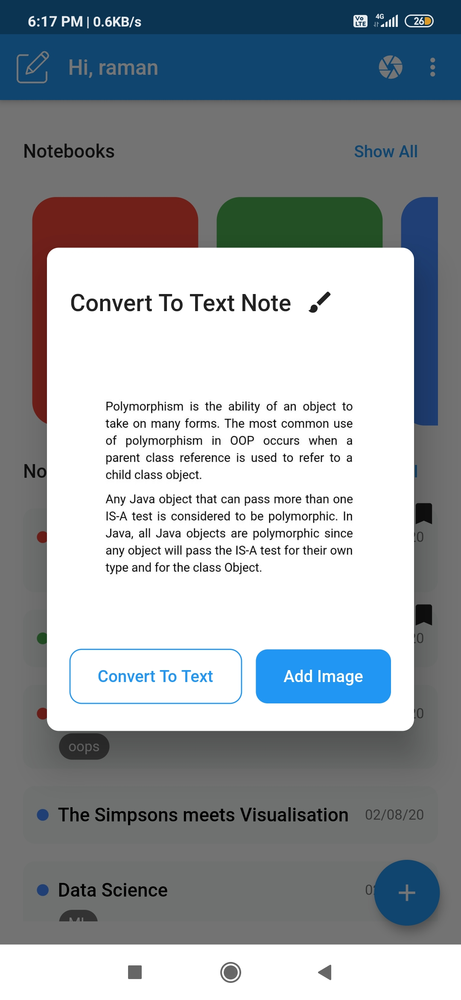
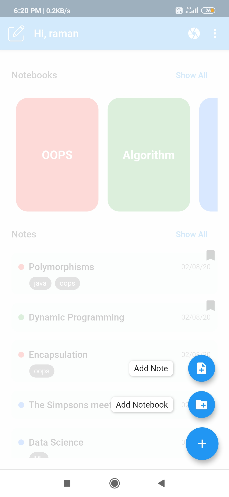
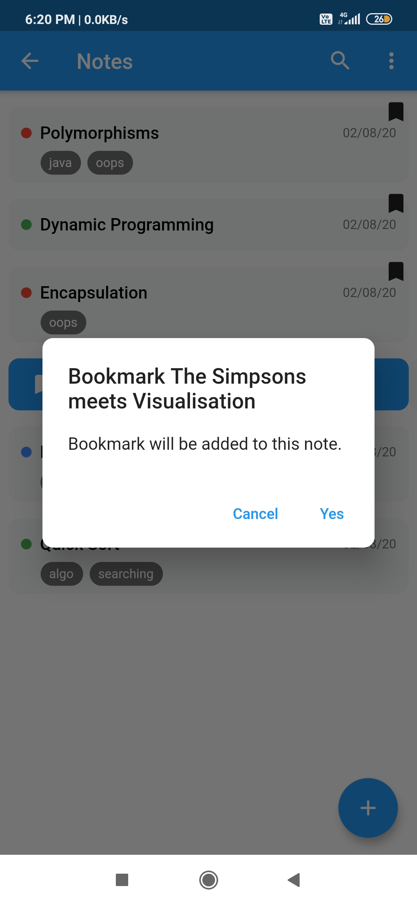
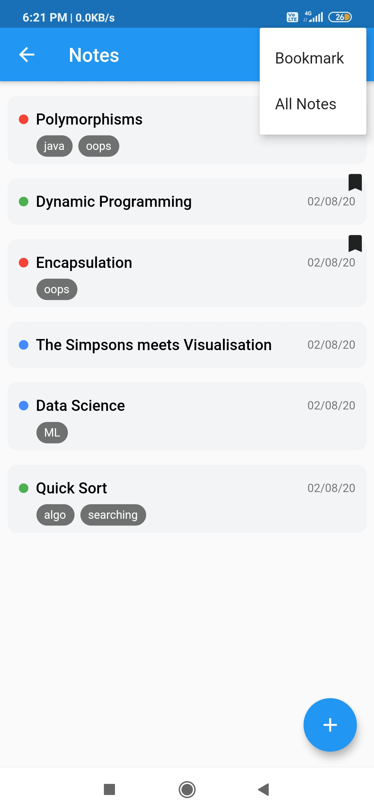
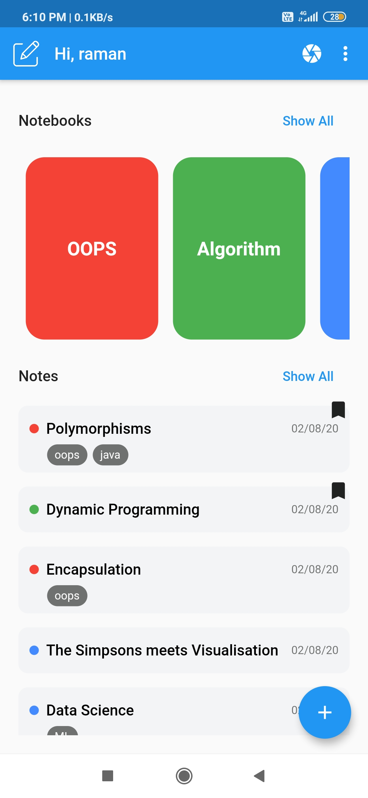
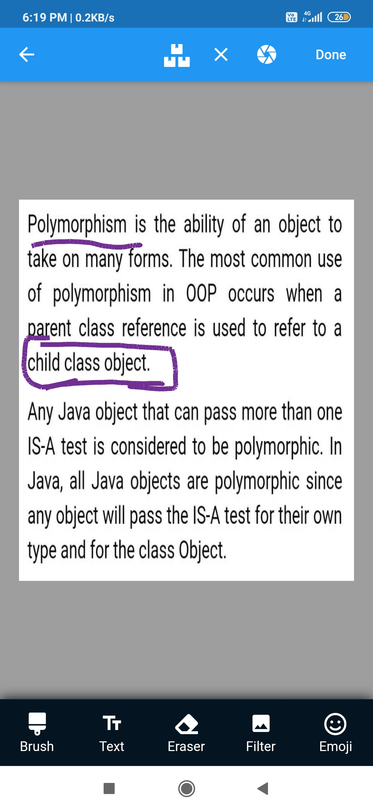
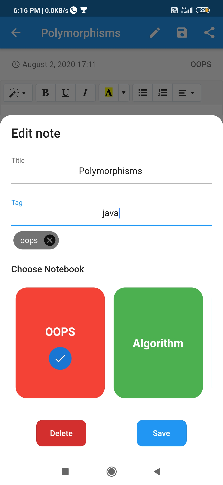
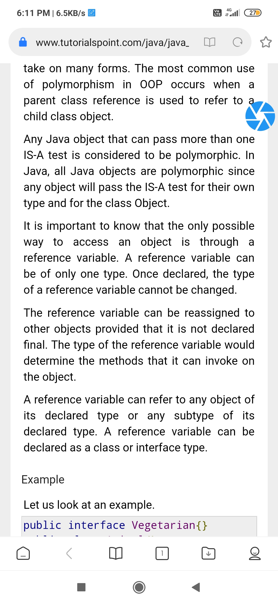
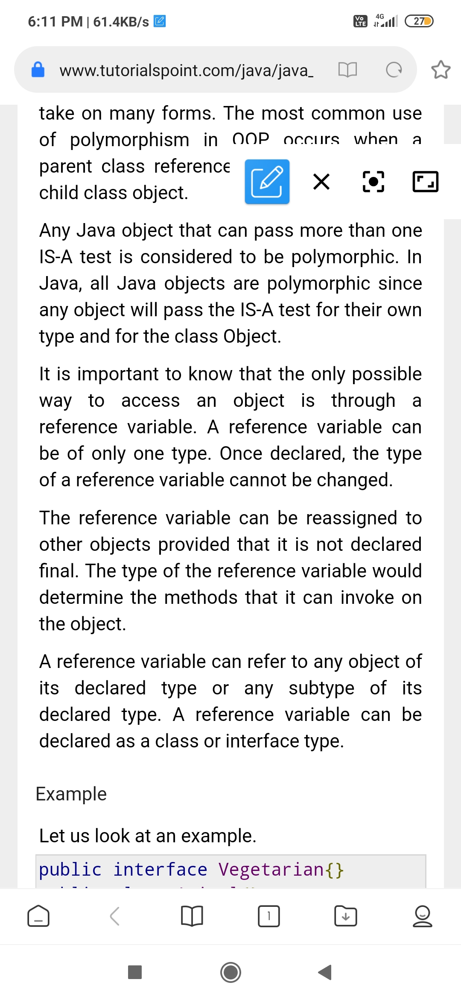
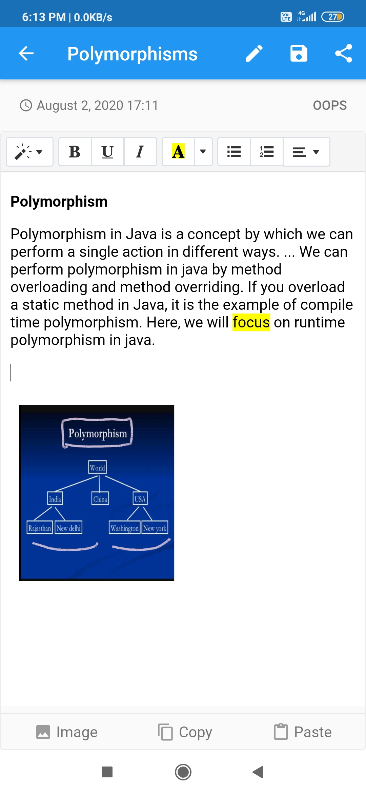
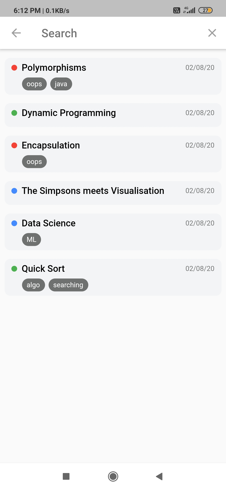
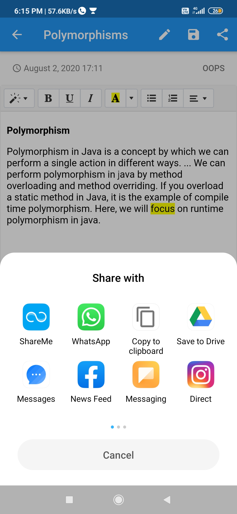
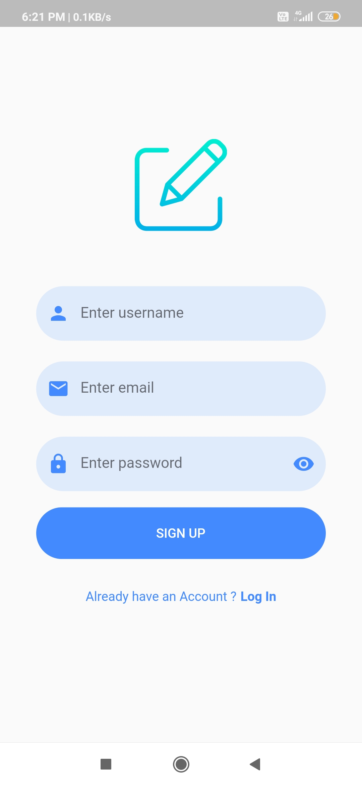
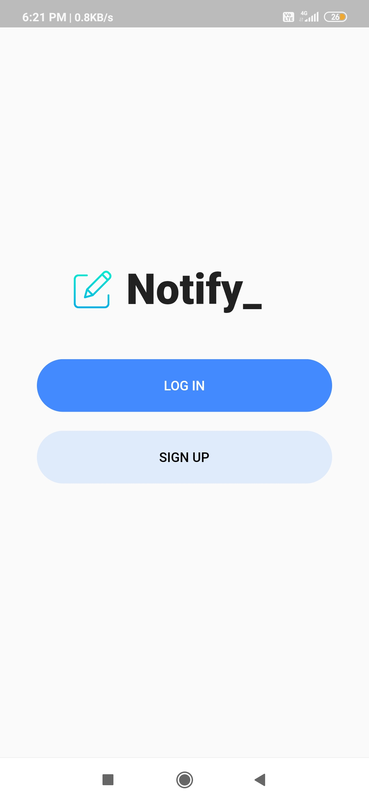

## Installation

- Add [Flutter](https://flutter.dev/docs/get-started/install) to your machine

- Open this project folder with Terminal/CMD and run `flutter packages get`

- Run `flutter run` to build and run the debug app on your emulator/phone

## New To Flutter
A few resources to get you started if this is your first time in flutter:

- [Lab: Write your first Flutter app](https://flutter.dev/docs/get-started/codelab)
- [Cookbook: Useful Flutter samples](https://flutter.dev/docs/cookbook)

For help getting started with Flutter, view our
[online documentation](https://flutter.dev/docs), which offers tutorials,
samples, guidance on mobile development, and a full API reference.

